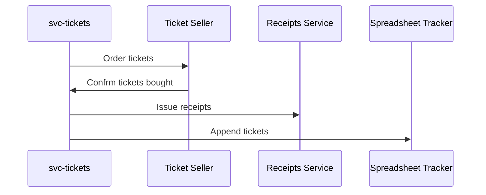

# Project: Asynchronous Calls

{{tip}}

Project files stay in the same `project` directory across all exercises.

{{endtip}}

Here's how our integration with the external ticketing systems works.

When the user chooses tickets and pays for the order, we call the ticketing system.
However, the API works in an asynchronous way.
We don't receive a response immediately; instead, a webhook is called with the order status.

If the ticket purchase is confirmed, we perform two actions for each ticket:

1. Issue a receipt for the client using a third-party API.
2. Add it to a "tracker" spreadsheet, so our team can print the physical copy and send it to the customer.



The spreadsheet integration is not the best possible experience, of course, but that's where the company is at the moment.

{{background}}
We have a ton of orders every day, and the receipts and spreadsheet APIs are not very reliable.
They sometimes fail for unknown reasons.

If this happens, we end up with no tickets printed and delivered (meaning angry customers) or
no receipts issued (meaning an angry accounting team).

We call both APIs for each ticket, so bulk orders are the worst.
If something goes wrong, some tickets are entirely skipped in both systems.
{{endbackground}}

It's fine if the receipt is delivered a few minutes after the purchase.
Likewise, the ticket row can be added to the spreadsheet a bit later.
But it's important that both eventually happen.

## Background Workers

Let's consider a more advanced take on jobs running in the background.
Thanks to Go's concurrency model, we can create a worker process that asynchronously handles the API calls.
We'll use channels to send messages to the worker, which will then process them in the background.

First, let's define a `Message` struct.
Each message consists of a task and a ticket ID; the task is a simple enum.

```go
type Task int

const (
	TaskIssueReceipt Task = iota
	TaskAppendToTracker
)

type Message struct {
	Task     Task
	TicketID string
}
```

An example worker implementation can look like this:

```go
type Worker struct {
	queue chan Message
}

func NewWorker() *Worker {
	return &Worker{
		queue: make(chan Message, 100),
	}
}
```

The key part of the worker is the `queue`, which is a channel of messages.
It's important to set the buffer size so that the worker can accept new messages while it's busy processing others.

We need a `Send` method that pushes appends new messages to the queue.

```go
func (w *Worker) Send(msg ...Message) {
	for _, m := range msg {
		w.queue <- m
	}
}
```

And a `Run` method, the main loop of the worker. It waits for new messages and processes them.

```go
func (w *Worker) Run() {
	for msg := range w.queue {
		switch msg.Task {
		case TaskIssueReceipt:
			// issue the receipt 
		case TaskAppendToTracker: 
			// append to the tracker spreadsheet
		}
	}
}
```

Using the Worker might look like this:

```go
w := NewWorker()
go w.Run()

w.Send(Message{
	Task:     TaskIssueReceipt, 
	TicketID: ticketID,
})
```

Note that `Run` is called in a separate goroutine.
Otherwise, it would block execution of the current function.

Similarly, `Send` is non-blocking (because of the buffered channel), so it won't wait for the message to be processed.
It pushes the message to the queue and returns immediately.
The worker processes the message in the background.

{{.Exercise}}

Let's start by making sure that temporary errors don't interfere with our orders.

**Implement a worker process similar to the one above.**

Move the logic from the HTTP handler to the worker's `Run` method.
Split it depending on the incoming task, so the proper service is called.

The HTTP handler should only send the messages for both tasks and have no other logic.
So for each ticket ID in the request, send two messages: one with `TaskIssueReceipt` and one with `TaskAppendToTracker`.

To make the worker retry failed messages, simply republish them using `Send` if an error happens.
The message will be added to the queue and processed later. This step is important so you don't lose messages while one of the APIs is down!

```go
if err != nil {
	w.Send(msg)	
}
```

Since the tasks are processed in the background, you don't want to use the request's context.
Otherwise, the requests would be canceled when the handler returns.
You need to replace the context passed to the API clients with `context.Background()`.

{{tip}}

In this exercise, the `receipts` service sometimes returns `500 Internal Server Error`.
This is expected. The worker needs to handle that and retry the request.

{{endtip}}
